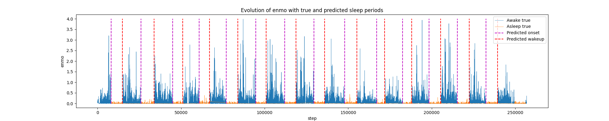
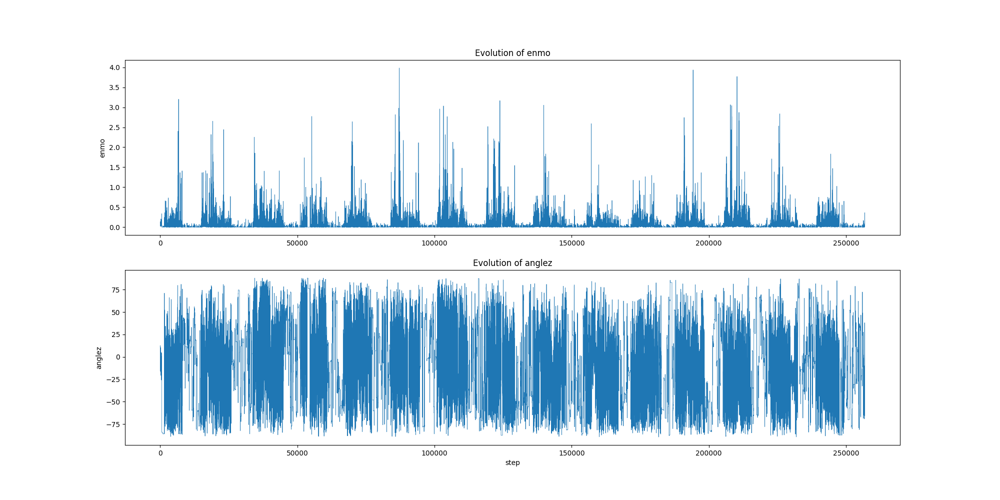
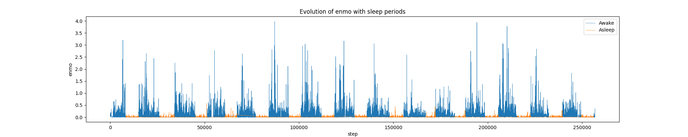

<div align="center">

# 😴 Child Mind Institute — Detect Sleep States

**Detect sleep onset & wakeup from wrist-worn accelerometer data.**

A Streamlit web app that turns raw accelerometer signals (`enmo` + `anglez`) into
predicted sleep periods using a trained scikit-learn pipeline.

[](https://www.python.org/)
[](https://streamlit.io/)
[](https://scikit-learn.org/)
[](LICENSE)
[](https://www.kaggle.com/competitions/child-mind-institute-detect-sleep-states)



</div>

---

## 📖 Overview

This project tackles the [**Child Mind Institute — Detect Sleep States**](https://www.kaggle.com/competitions/child-mind-institute-detect-sleep-states)
Kaggle competition. Children wear an accelerometer on the wrist; the device records
two signals every **5 seconds**, and the goal is to detect when the child **falls
asleep** (`onset`) and **wakes up** (`wakeup`).

The repository ships a **deployed inference app** built with Streamlit on top of a
trained, serialized model (`pipeline_v2.pkl`). Data sources:

- ✨ **Pick a bundled sample series** to try it instantly,
- 📤 **Upload** your own accelerometer data (CSV or Parquet), or
- 🧪 **Generate synthetic data** right in the app.

The app is organised into tabs:

- **🔍 Analyze** — 8 clinical sleep metrics (efficiency, latency, awakenings,
  longest/shortest…) with **good/fair/low** ratings and the recording's date range;
  an **interactive timeline** with shaded sleep spans, a **hypnogram** state band and
  an optional **anglez** overlay; a **per-night breakdown** + nightly-duration trend;
  an **actogram** sleep-regularity heatmap; and downloads (predictions CSV + a
  self-contained **HTML report**).
- **📊 Batch** — a summary table across *every* series in the data.
- **🆚 Compare** — two series side by side.
- **🤖 Model** — a model card with cross-validation metrics and feature importances.

Live **detection settings** (sleep/wake threshold, smoothing window, minimum sleep
period) in the sidebar — with a **reset** button and a **🌗 dark/light toggle** —
let you tune sensitivity and see results update. Charts are subsampled and the
analysis is cached/shared across tabs for a fast, responsive feel, with a progress
indicator while the model runs.

> The model is **gradient-boosted trees (XGBoost)** wrapped in a scikit-learn
> preprocessing pipeline — not a deep neural network. The bundled `pipeline_v2.pkl`
> is a modern, portable model (re-trained via self-distillation, see
> [Model details](#-model-details)); the original is kept as
> `pipeline_01_legacy.pkl`.

---

## 🎬 Demo

| Raw features (`enmo`, `anglez`) | Labelled sleep periods | Model predictions |
| :---: | :---: | :---: |
|  |  |  |

> _Tip:_ once deployed (e.g. on [Streamlit Community Cloud](https://streamlit.io/cloud)),
> add the live URL here.

---

## 🗂️ Data schema

The app expects a table with these columns (one row per 5-second reading):

| Column | Type | Description |
| --- | --- | --- |
| `series_id` | `str` | Unique ID for one accelerometer recording (a subject across several days). |
| `step` | `int` | Row index within a series (5-second cadence). |
| `timestamp` | `str` | ISO datetime of the reading. |
| `anglez` | `float` | Angle of the arm relative to the vertical axis of the body. |
| `enmo` | `float` | Euclidean Norm Minus One of the accelerometer signals (negatives clipped to 0). |

---

## 🧪 Engineered features

`feature_engineering()` derives the **13 inputs** the model is trained on:

| Feature | Meaning |
| --- | --- |
| `anglez`, `enmo` | Raw accelerometer signals. |
| `enmo_centered` | Per-series rolling-mean of `enmo`, mean-clipped and centered. |
| `hour` | Hour of day (0–23). |
| `moment` | Part of day — night / morning / afternoon / evening. |
| `anglez_abs` | Absolute arm angle. |
| `anglez_diff`, `enmo_diff` | Lagged differences over ~1 minute (12 steps). |
| `anglez_rolling_mean`, `enmo_rolling_mean` | Centered rolling means. |
| `enmo_x_anglez`, `enmo_x_anglez_abs` | Interaction terms. |
| `is_weekend` | 1 on Saturday/Sunday, else 0. |

See **[docs/ARCHITECTURE.md](docs/ARCHITECTURE.md)** for the exact maths.

---

## ⚙️ How it works

```
 CSV / Parquet upload  (or bundled sample)
            │
            ▼
   check_df()  ── validate schema & types
            │
            ▼
   feature_engineering()  ── preprocess_col + get_features  → 13 features
            │
            ▼
   pipeline_v2.pkl  ── ColumnTransformer → XGBoost  → P(awake)
            │
            ▼
   smooth_results()  ── per-series rolling mean, re-binarise
            │
            ▼
   get_events()  ── derive onset / wakeup from prediction transitions
            │
            ▼
   keep_periods()  ── drop sleep/activity periods shorter than the minimum
            │
            ▼
   sleep metrics  +  interactive Plotly charts  +  CSV / HTML report
```

---

## 🧠 Model details

- **Served model (`pipeline_v2.pkl`):** a scikit-learn `Pipeline` of `prepross`
  (a `ColumnTransformer` with `StandardScaler` for numeric features +
  `OneHotEncoder` for `moment`) followed by an **XGBoost** classifier (`xgb`),
  predicting `P(awake)`.
- **How it was built:** **self-distillation** — the original model
  (`pipeline_01_legacy.pkl`, a scikit-learn 1.3.x pickle that only loads on
  Python 3.11) labels the sample series, and a fresh pipeline is trained to
  reproduce it with whatever scikit-learn/XGBoost is installed. The result is **portable** (no version lock)
  and matches the original closely (out-of-fold AP ≈ 0.999, ~98% row agreement).
  Re-create it with `python scripts/train_model.py`; metrics land in
  `models/model_metrics.json` and are shown on the app's **Model** tab.
- **Training rigor:** `GroupKFold` by `series_id` (no subject leaks across folds).
- **Target:** `awake` (1 = awake, 0 = asleep), post-processed into onset/wakeup events.
- **Legacy model:** the original is preserved as `pipeline_01_legacy.pkl`; the app
  falls back to it if `pipeline_v2.pkl` is absent.
- **Training notebook:** `detect-sleep-states-starter-notebook-ensemble.ipynb`
  separately explores a LightGBM + Random Forest ensemble — see
  [Known limitations](#️-known-limitations).

---

## 📁 Project structure

```
.
├── app.py                                          # Streamlit web app (tabbed: Analyze/Batch/Compare/Model)
├── utils.py                                         # Features, prediction, post-processing, metrics, plots
├── detect-sleep-states-starter-notebook-ensemble.ipynb  # Exploratory training notebook
├── pipeline_v2.pkl                                  # Portable served model (modern sklearn)
├── pipeline_01_legacy.pkl                           # Original model (sklearn 1.3.x; fallback)
├── requirements.txt                                 # Python dependencies
├── scripts/
│   └── train_model.py                               # (Re)train / self-distill the model
├── models/
│   └── model_metrics.json                           # CV metrics + feature importances (Model tab)
├── data/                                            # Sample & example CSVs
│   ├── input_series_1.csv                           #   bundled sample series (1–3)
│   ├── input_series_2.csv
│   ├── input_series_3.csv
│   └── my_sample_upload.csv                         #   synthetic multi-series file for upload testing
├── input_*.png / input_*.jpg                        # Images used by the app
├── tests/test_utils.py                              # Unit tests
├── docs/ARCHITECTURE.md                             # Deep-dive on the pipeline
├── LICENSE
└── README.md
```

---

## 🚀 Installation

> [!NOTE]
> The app serves the **portable `pipeline_v2.pkl`**, which loads on any modern
> scikit-learn — so you are no longer locked to Python 3.11. If you instead force
> the **legacy** model (`pipeline_01_legacy.pkl`), use Python 3.11 + the pinned
> `requirements.txt`, since that pickle (scikit-learn 1.3.x) breaks on newer
> versions with `'str' object has no attribute 'transform'`. The pinned versions
> also have prebuilt wheels for 3.11; on 3.12+ you may prefer unpinned installs.
> If you ever change `utils.feature_engineering`, regenerate the model with
> `python scripts/train_model.py`.

```bash
# 1. Clone
git clone https://github.com/akshatabiradars/Child-Mind-Institute-Detect-Sleep-States.git
cd Child-Mind-Institute-Detect-Sleep-States

# 2. Create a Python 3.11 virtual environment
# Windows (py launcher):
py -3.11 -m venv .venv311
.venv311\Scripts\activate
# macOS / Linux:
python3.11 -m venv .venv311
source .venv311/bin/activate

# 3. Install dependencies (lightgbm is required to load the model)
pip install -r requirements.txt
```

---

## ▶️ Usage

```bash
streamlit run app.py
```

Then in the browser:

1. In the sidebar, pick a **sample series**, **upload** a `.csv`/`.parquet` file
   with the [schema above](#️-data-schema), or **generate synthetic data**. A
   preview confirms the file parsed correctly.
2. Optionally tune the **detection settings** (threshold, smoothing, minimum sleep)
   — or hit **↺ Reset to defaults**.
3. **🔍 Analyze** — KPIs (with good/fair/low ratings), interactive timeline with a
   hypnogram band (toggle `anglez`), per-night breakdown & trend, actogram; download
   the predictions CSV or an HTML report.
4. **📊 Batch** / **🆚 Compare** / **🤖 Model** — multi-series rollup, side-by-side
   comparison, and the model card.

An **About & how it works** expander (with example images) sits below the tabs.

(Re)train the model with `python scripts/train_model.py`.

---

## ⚠️ Known limitations

- **Distilled, not ground-truth-trained:** `pipeline_v2.pkl` is distilled from the
  legacy model (no labelled training set ships with the repo), so it **inherits the
  original's behaviour** rather than learning from true `awake` labels. Train on real
  labels with `python scripts/train_model.py --train-data PATH` for an independent model.
- **Model mismatch (notebook vs. served):** the notebook explores a LightGBM + Random
  Forest ensemble, but the served model is an **XGBoost** pipeline. The notebook is
  exploratory and is not wired into the app.
- **Legacy pickle is version-locked:** `pipeline_01_legacy.pkl` only unpickles cleanly
  on scikit-learn 1.3.x / Python 3.11. The app prefers the portable `pipeline_v2.pkl`,
  so this only matters if you force the legacy model.
- **Sleep efficiency reads low:** it is `total sleep ÷ recording span`, and the sample
  recordings include long awake daytime stretches (tooltip explains this in-app).
- **Short / partial series:** `keep_periods()` expects each series to contain at least one
  complete `onset → wakeup` cycle longer than the minimum; the app surfaces a friendly
  message instead of crashing when it cannot.
- **Reference data sizes:** the bundled CSVs are ~6.5 MB each (~100k rows) for quick demos.

---

## 📚 References

- The Comprehensive R Archive Network — [Accelerometer data processing with GGIR](https://cran.r-project.org/web/packages/GGIR/vignettes/GGIR.html#4_Inspecting_the_results)
- National Library of Medicine — [Segmenting accelerometer data from daily life with unsupervised machine learning](https://www.ncbi.nlm.nih.gov/pmc/articles/PMC6326431/)
- Nature, Scientific Reports — [Estimating sleep parameters using an accelerometer without sleep diary](https://www.nature.com/articles/s41598-018-31266-z)

---

## 📄 License

Released under the [MIT License](LICENSE).

## 🙏 Acknowledgements

Thanks to the Child Mind Institute, the Kaggle community, and Stack Overflow.

## ✉️ Contact

**Akshata Biradar** — akshatabiradars2003@gmail.com
[GitHub](https://github.com/akshatabiradars) · [LinkedIn](https://www.linkedin.com/in/akshata-biradar-bb6306257)
